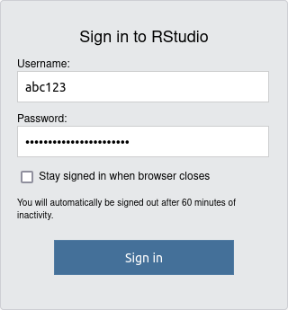

.. _p_service_r:

###############
 R and RStudio
###############

Users of the Esrum cluster have the option running R directly or via two
RStudio servers.

.. warning::

   The RStudio servers are *only* for running R. If you need to run
   other tasks then you *must* connect to the head node and run them
   using Slurm as described in :ref:`p_usage_slurm`.

   Resource intensive tasks running on the RStudio server will likely
   negatively impact everyone using the service, and we may therefore
   terminate such tasks without warning if we deem it necessary.

************
 R on Esrum
************

This section describes steps required to use R and lays out various tips
for making your work easier. See below

While it is also possible to use R on a compute node interactively, this
page section focuses in particular on how to run R scripts
non-interactively via Slurm in order to take full advantage of the
available compute resources.

Selecting an R version
======================

Several versions of R are available via the module system. To load
these, you need to load the version of R you want *and* a version of
GCC_, which is required to install/load R libraries.

If you intend to also make use of the RStudio servers, then we recommend
that you ``R/4.3.3`` (or another version of ``R/4.3.x``) with
``gcc/8.5.0``. This ensures that the R libraries you install are
compatible between the compute nodes and the RStudio servers.

By default, the 4.3.x versions of R loads ``gcc/8.5.0``, so you can
simply use the ``--auto`` option when loading ``R/4.3.x``:

.. code:: shell

   $ module load --auto R/4.3.3
   Loading R/4.3.3
     Loading requirement: gcc/8.5.0

R modules installed using versions of R other than ``4.3.x`` will not be
available on the RStudio server and you will need to install them again.

.. warning::

   Using a GCC version greater than 8.x with ``R/4.3.x`` may cause
   modules you install to fail to load on the RStudio server with the
   errors similar to the following:

   .. code::

      Error: package or namespace load failed for ‘wk’ in dyn.load(file, DLLpath = DLLpath, ...):
      unable to load shared object '/home/abc123/R/x86_64-pc-linux-gnu-library/4.3/wk/libs/wk.so':
      /lib64/libstdc++.so.6: version `GLIBCXX_3.4.26' not found (required by /home/abc123/R/x86_64-pc-linux-gnu-library/4.3/wk/libs/wk.so)

   See the Troubleshooting section below for more information.

Submitting R scripts using Slurm
================================

The recommended way to run R on Esrum is as non-interactive scripts
submitted to slurm. This not only ensures that your analyses do not
impact other users, but also makes make your analyses reproducible.

To run an R script on the command-line, simply use the ``Rscript``
command:

.. code:: shell

   $ cat my_script.R
   cat("Hello, world!\n")
   $ Rscript my_script.R
   Hello, world!

For simple scripts you can use the ``commandArgs`` function to pass
arguments to your scripts, allowing you to use them to process arbitrary
data-sets:

.. code:: R

   args <- commandArgs(trailingOnly = TRUE)

   cat("Hello, ", args[1], "!\n", sep="")

.. code:: console

   $ Rscript my_script.R world
   Hello, world!

If your script requires a heterogenous set of input files or options to
run, then it is recommended to use an argument parser such as the
argparser_ R library. To use the argparser library you must first
install it using the ``install.packages("argparser")`` command.

The following is a brief example of how you might use the ``argparser``
library and it can also be downloaded :download:`here
<scripts/argparser.R>`.

.. literalinclude:: scripts/argparser.R
   :language: R

This allows you to document your command-line options, specify default
values, and much more:

.. code:: shell

   $ Rscript my_script.R
   usage: my_script.R [--] [--help] [--opts OPTS] [--p-value P-VALUE]
       input_file

   This is my script!

   positional arguments:
   input_file     My data

   flags:
   -h, --help     show this help message and exit

   optional arguments:
   -x, --opts     RDS file containing argument values
   -p, --p-value  Maximum P-value [default: 0.05]

   Error in parse_args(parser) :
   Missing required arguments: expecting 1 values but got 0 values: ().
   Execution halted
   $ Rscript my_script.R my_data.tsv
   I would process the file my_data.tsv with a max P-value of 0.05

Finally, you write can write a small bash script to automatically load
the required version of R and to call your script when you submit it to
Slurm (using your preferred version of R):

.. code:: console

   $ cat run_rscript.sh
   #!/bin/bash

   module load gcc/8.5.0 R/4.1.2
   Rscript "${@}"

The ``"${@}"`` safely passes all your command-line arguments to
``Rscript``, even if they contain spaces. This wrapper script can then
be used to submit/call any of your R-scripts:

.. code:: console

   $ sbatch run_rscript.sh my_script.R my_data.tsv --p-value 0.01
   Submitted batch job 18090212
   $ cat slurm-18090212.out
   I would process the file my_data.tsv with a max P-value of 0.01

Installing R modules
====================

Modules may be installed in your home folder using the
``install.packages`` command:

.. code:: console

   $ module load gcc/8.5.0 R/4.3.1
   $ R
   > install.packages("ggplot2")
   Warning in install.packages("ggplot2") :
     'lib = "/opt/software/R/4.3.1/lib64/R/library"' is not writable
   Would you like to use a personal library instead? (yes/No/cancel) yes
   Would you like to create a personal library
   ‘/home/abc123/R/x86_64-pc-linux-gnu-library/4.3’
   to install packages into? (yes/No/cancel) yes

When asked to pick a mirror, either pick ``0-Cloud`` by entering ``1``
and pressing enter, or enter the number corresponding to a location near
you and press enter:

.. code:: console

   --- Please select a CRAN mirror for use in this session ---
   Secure CRAN mirrors

   1: 0-Cloud [https]
   [...]

   Selection: 1

.. _s_service_rstudio:

*****************
 RStudio servers
*****************

The RStudio_ servers can be found at https://esrumweb01fl/rstudio/ and
https://esrumweb02fl/rstudio/. You *must* have applied for access as
described on the :ref:`p_usage_access_applying` page, and you *must* be
connected via the UCPH VPN in order to connect to these servers.

If you have not been granted access, or if you are not connected via the
VPN, then you will likely see a browser error message like ``This site
can't be reached``. See :ref:`p_usage_connecting` for more information.

To login, use the short form of your UPCH username (i.e. ``abc123``):

RStudio server best practice
============================

Since the RStudio server is a shared resource where that many users may
be using simultaneously, we ask that you show consideration towards
other users of the server.

In particular,

-  Try to limit the size of the data-sets you work with on the RStudio
   server. Since *all* data has to be read from (or written to) network
   drives, one person reading or writing a large amount of data can
   cause significant slow-downs for *everyone* using the service.

   We therefore recommend that you load a (small) subset of your data in
   RStudio, that you use that subset of data to develop your analyses
   processes, and that you use that to process your complete dataset via
   an R-script submitted to Slurm as described in :ref:`p_usage_slurm`.

   See the :ref:`p_service_r` page for additional guidance on how to use
   R with Slurm.

-  Don't keep data in memory that you do not need. Data that you no
   longer need can be freed with the ``rm`` function or using the broom
   icon on the ``Environment`` tab in RStudio. This also helps prevent
   RStudio from filling your home folder when your session is closed
   (see Troubleshooting below).

-  Do not run resource intensive tasks via the embedded terminal. As
   noted above, such tasks will be terminated without warning if deemed
   to have a negative impact on other users. Instead, such tasks should
   be run using Slurm as described in :ref:`p_usage_slurm`.

Preserving loaded data
======================

Data that you have loaded into R and other variables you have defined
are visible on the ``Environment`` tab in RStudio along with the amount
of memory used (here 143 MiB):

.. image:: images/rstudio_environment.png
   :align: center

By default, this data will be saved to your RStudio folder on the
``/scratch`` drive when you quit your session or when it automatically
suspends after 9 hours of inactivity. This may, however, result in very
large amounts of data being saved to disk and, consequently, large of
amounts of data having to be read when you log in again, resulting in
login taking a very long time.

For this reason we recommend disabling the saving and loading of
``.RData`` in the ``Global Settings`` accessible via the ``Tools Menu``
as shown:

.. image:: images/rstudio_workspace_data.png
   :align: center

This ensures that you always start with a fresh session and that you
therefore are able to log in quickly to the RStudio server.

It is also recommended that the ``Always save history (even when not
saving .RData)`` option is enabled, as the commands you type into the R
terminal will otherwise *not* be saved.

*****************
 Troubleshooting
*****************

.. include:: r_troubleshooting.rst

.. include:: rstudio_troubleshooting.rst

.. _argparser: https://cran.r-project.org/web/packages/argparser/index.html

.. _gcc: https://gcc.gnu.org/

.. _heads: https://heads.ku.dk/

.. _rstudio: https://posit.co/products/open-source/rstudio/
