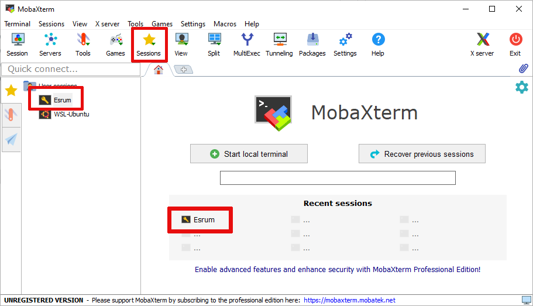
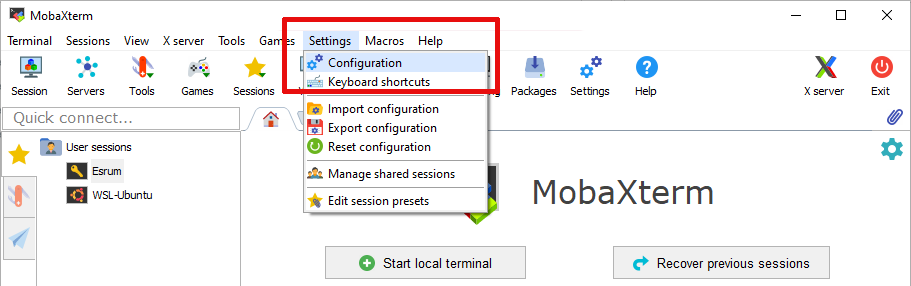
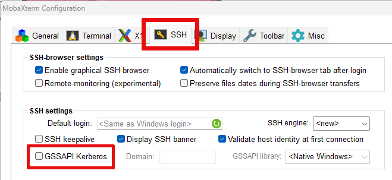
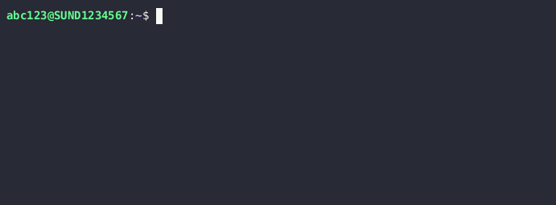

.. _p_usage_connecting:

###########################
 Connecting to the cluster
###########################

If you have not already applied for and been granted access to the
cluster, then please see the :ref:`p_usage_access_applying` page before
continuing.

The cluster's is accessible via SSH at ``esrumhead01fl.unicph.domain``.
This is the Esrum "head" node, which serves as the entry-point for the
cluster and which gives you access to the job management system used for
running software (see :ref:`p_usage_slurm`)

To connect to the cluster you will typically need to be connected to the
UCPH VPN. For information about connecting to the VPN, see the support
pages on KUnet in Danish_ and English_. See also the
:ref:`s_connecting_linux` section for an alternative means of connecting
to the VPN.

***********************
 Connecting on Windows
***********************

Windows users will need to install a SSH client in order to be able to
connect to the server. Options include MobaXterm_, Putty_, and Windows
Subsystem for Linux (WSL_), and much more. The following demonstrates
how to set up MobaXterm. Please refer to the :ref:`s_connecting_linux`
section if using WSL_.

.. _s_configure_mobaxterm:

Configuring MobaXterm
=====================

#. Install and open MobaXterm.

#. Click left-most ``Session`` button on the toolbar.

   .. image:: images/mobaxterm_01.png
      :align: center

#. Click on the left-most ``SSH`` button on the resulting ``Session
   settings`` dialog

   .. image:: images/mobaxterm_02.png
      :align: center

#. Under ``Basic SSH settings``

   #. Write ``esrumhead01fl.unicph.domain`` under ``Remote Host``
   #. Click the checkbox next to ``Specify username`` and enter your
      UCPH username (in the form ``abc123``)
   #. Select ``SCP (enhanced speed)`` on the ``SSH-browser`` type
      drop-down menu. This is required for file-uploads to work.

   .. image:: images/mobaxterm_03.png
      :align: center

#. Click on the ``Bookmark settings`` tab and

   #. Write ``Esrum`` or a name you prefer under ``Session Name``

   #. Optionally click the ``Create a desktop shortcut to this session``
      button. This will create a shortcut on your desktop that connects
      to Esrum.

   .. image:: images/mobaxterm_04.png
      :align: center

#. Click OK and you should connect to the server. The first time you
   connect a new server you if you want to proceed. As this is the first
   time we are connecting to Esrum, simply press Accept:

   .. image:: images/mobaxterm_05.png
      :align: center

   .. warning::

      If you receive this question again later, then stop and
      double-check that you are connected via the UCPH VPN, as the
      message could indicate that you are not actually connecting to
      Esrum!

#. You should now be able to log in to the server:

   .. image:: images/mobaxterm_06.png
      :align: center

#. For security reasons we recommend that you decline when asked if you
   want to save your password.

Reconnecting with MobaXterm
===========================

To connect again another time, either use the desktop shortcut (if you
created it), double-click on ``Esrum`` in the list of sessions on the
left side of MobaXterm, or select ``Esrum`` from the list that appears
when clicking on the ``Sessions`` button on the main menu.

.. _s_network_drives_mobaxterm:

Accessing network drives via MobaXterm
======================================

In order to access your UCPH network drives (``H:``, ``N:``, and ``S:``)
via Esrum, you must disable logins using Kerberos (GSSAPI). To do so,
open the ``Configuration`` dialog as shown:

Then untick the ``GSSAPI Kerberos`` checkbox as shown and click the
``OK`` button:

.. _s_connecting_osx:

*******************
 Connecting on OSX
*******************

While Mac/OSX users can connect as described in the
:ref:`s_connecting_linux` section below, there are also graphical
interfaces available, including for example Tabby_.

..
   TODO: Describe how to setup tabby.

.. _s_connecting_linux:

*********************
 Connecting on Linux
*********************

The official instructions for connecting to the VPN under Linux (in
Danish_ and English_) are written under the assumption that you are
using KDE5. If that is not the case, or if you prefer a command-line
solution, then you can also connect using ``openconnect``, replacing
``abc123`` with your UCPH username:

.. code:: shell

   $ sudo openconnect -u abc123 vpn.ku.dk

Depending on how you have configured `multifactor authentication for
UCPH <https://mfa.ku.dk>`_, you will have to authenticate the login
using one of the following methods:

-  If using NetIQ, open the app on your phone and approve the login.
-  If asked, enter the time based one-time password (TOTP) generated by
   the app you have enrolled

.. note::

   It may be possible to authenticate using additional methods, such as
   Yubikeys, but we currently cannot offer a guide to using those with
   ``openconnect``.

You will likely have to install ``openconnect`` first, in which case
please refer to the documentation for the Linux distro you are using.
OSX users can install ``openconnect`` using Homebrew_.

Once connected to the VPN, you can connect to the cluster using ``ssh``
and the following terminal command, again replacing ``abc123`` with your
UCPH username:

.. code::

   $ ssh abc123@esrumhead01fl.unicph.domain

It is recommended to add an entry for the cluster to your
``.ssh/config`` file, replacing ``abc123`` with your UCPH username:

.. code::

   $ cat ~/.ssh/config
   Host esrum esrumhead01fl esrumhead01fl.unicph.domain
       HostName esrumhead01fl.unicph.domain
       User abc123

This allows you to connect to the server using the names ``esrum``,
``esrumhead01fl``, or ``esrumhead01fl.unicph.domain``, and without
having to specify your username:

.. code::

   $ ssh esrum
   abc123@esrumhead01fl.unicph.domain's password:
        __
       /  \
      _\__/  Welcome to esrumhead01fl
     (_)     University of Copenhagen
   _____O______________________________________
   Supported by UNICPH IT  it.ku.dk/english

   Last login: Fri Oct 13 01:35:00 1980 from 127.0.0.1
   $

.. note::

   Note that the cluster *does not* support authentication through a
   public SSH key and that you therefore have to enter your password
   when connecting to the server.

.. _s_connecting_troubleshooting:

*****************
 Troubleshooting
*****************

.. include:: connecting_troubleshooting.rst

.. _danish: https://kunet.ku.dk/medarbejderguide/Sider/It/Fjernadgang-vpn.aspx

.. _english: https://kunet.ku.dk/employee-guide/Pages/IT/Remote-access.aspx

.. _homebrew: https://brew.sh/

.. _mobaxterm: https://mobaxterm.mobatek.net/

.. _putty: https://www.putty.org/

.. _tabby: https://github.com/Eugeny/tabby

.. _wsl: https://learn.microsoft.com/en-us/windows/wsl/about
