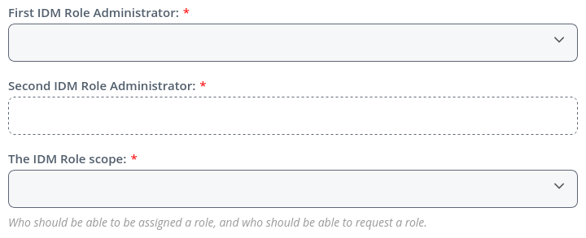
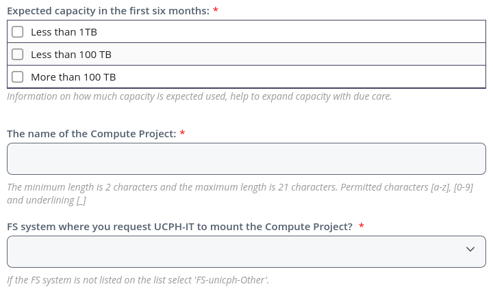
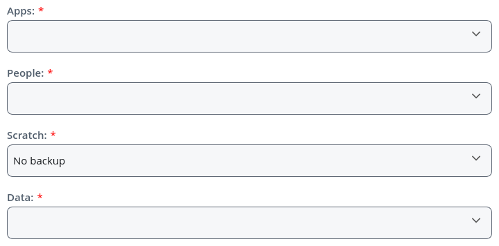
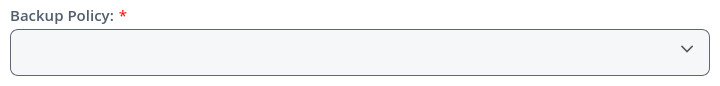
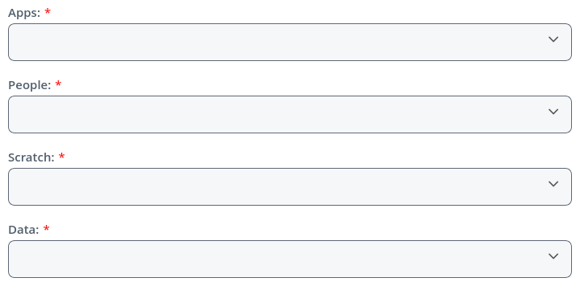
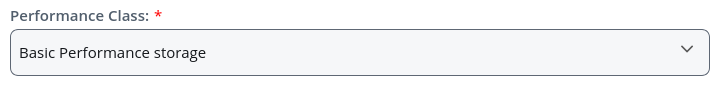
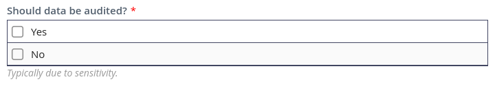

.. _p_usage_projects:

################################
 Creating projects and datasets
################################

This page describes how to request new projects (located in
``/projects``) and datasets (``/datasets``). For a detailed description
of these, see the :ref:`p_usage_filesystem` page.

Presently, instructions are given in English only, and it may therefore
be helpful to change your Serviceportal_ language to English using the
gear icon (⚙) on the left side of the page.

Briefly,

-  Projects are meant to house apps, data, and results for individual
   projects and the people working on those projects. Every member of a
   project will have write access to the standard subfolder in the
   project folder, and will be able to deposit data.

-  Datasets are meant for static data and as such only the owner has the
   ability to add or modify files in a dataset. This is useful for both
   raw data and for results that are intended to be shared across
   different projects.

.. warning::

   When dealing with GDPR projected data, the project and datasets
   should correspond to the data processing agreement in place for each
   dataset. *Do not* store datasets under different GDPR data processing
   agreement in the same project or dataset. Similarly, do not place
   GDPR protected and non-GDPR protected data in the same
   project/dataset, if different people needs access to the GDPR and
   non-GDPR data. Keeping datasets separate ensures that only people
   with relevant permissions from the data owner are able to access the
   GDPR protected data.

***********************************
 Creating a new project or dataset
***********************************

To request the creation of a new project or dataset, log in to the
UCPH-IT Serviceportal_:

#. Click the ``Create ticket`` button.

   #. If you want to create a project, search for ``Compute Projects``
      and click the ``Compute Projects (Network file service)`` button
      under the ``Research IT`` subsection.

   #. If you want to create a dataset, search for ``Compute Dataset``
      and click the ``Compute Dataset (Network file service)`` button
      under the ``Research IT`` subsection.

#. Click the ``REQUEST`` button on the resulting popup.

You should now be on the ``Compute Projects (Network file service)`` or
the ``Compute Dataset (Network file service)`` order page, depending on
the type of folder you wanted to create. This page is split into a
number of sections, all of which have to be filled out:

IDM
===

In this section you have to enter two ``IDM Role Administrators``. These
are the people responsible for administrating access to the project via
the `Identity Management System`_. We highly recommend that *at least*
one of these two people are a permanent employee at CBMR (e.g. a PI or
staff scientist), to ease transitions if an employee on a temporary
contract leaves the center.

Finally, the ``IDM Role scope`` defines who can be granted access to the
project. The ``Employed + Associated`` option is recommended in most
cases.

Compute Project / Compute Dataset
=================================

Firstly enter the ``Expected capacity in the first six months``, i.e.
how much storage capacity you anticipate needing for your project in the
next six months. This is not a hard limit, but is rather an indication
to UCPH-IT to help them prepare for growing needs.

Secondly, enter a name for the project or dataset. The name has to be
unique across UCPH, so it may be helpful to include either a center name
(*e.g.* ``cbmr_``) or group name (*e.g.* ``dap_``) as a prefix. Note
that this name is public. Only letters (``a`` to ``z``), digits (``0``
to ``9``), and underscores (``_``) are allowed.

Finally, pick ``FS-esrum`` for the option ``FS system where you request
UCPH-IT to mount the Compute Project``.

Backup Policy
=============

|

Depending on whether you are creating a project (top image) or dataset
(bottom image), you will either have to select backup policies for three
folders (``Apps``, ``People``, and ``Data``) or for the entire dataset
folder.

-  If your project or dataset contains *any* GDPR protected data, then
   you *must* select ``GDPR backup`` policy for all folders. As this
   option imposes limits on how backups are stored and how they can be
   accessed, you should *only* pick the ``GDPR backup`` option if the
   data is GDPR protected.

-  If your project does not contain GDPR protected data, then we
   recommend that you pick the ``Basic backup`` policy for all folders.

The ``Scratch`` folder does not have backups and as such no policy
choice needs to be made for this folder.

Performance class
=================

|

Depending on whether you are creating a project (top image) or dataset
(bottom image), you will either have to a performance policy for three
folders or for the entire dataset folder.

-  For projects, we recommend that you select ``Basic Performance
   storage`` for ``Apps``, ``People``, ``Data``, and for datasets, and
   that you select ``High Performance storage`` for ``Scratch``.

-  For datasets, we recommend selecting ``Basic Performance storage``.

Audit
=====

If *any* of the data that is going to be stored in this project or
dataset is covered by the GDPR, or is otherwise sensitive, then you
*must* select ``Yes`` for the option ``Should data be audited``.

Review & Submit
===============

Once you have filled in the above sections, click the ``Review &
Submit`` button, verify your choices, and then click ``Submit`` to

.. _identity management system: https://identity.ku.dk/

.. _serviceportal: https://serviceportal.ku.dk/
