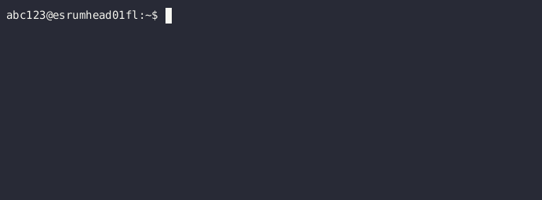

.. _p_usage_slurm_advanced:

#####################
 Advanced Slurm jobs
#####################

The following page describes how to use the ``srun`` command to run
simple commands on the cluster, how to queue batches of jobs using
``sbatch``, including how to manage these jobs and how to map

.. _s_sbatch_environment:

***********************************
 Controlling environment variables
***********************************

By default, your ``sbatch`` script and ``srun`` command will inherit
environment variables set before you run ``sbatch``/``srun``. This means
that, among other things, modules loaded prior to running your job will
remain loaded once your job starts running.

However, if you are running tools that are affected by environment
variables, this may result in your script acting differently depending
on in what context you run it, and making it hard to reproduce your
analyses. To mitigate this, it is possible to control what environment
variables are inherited via the ``--export`` option for
``sbatch``/``srun``.

The recommended usage is ``--export=TMPDIR``, which only inherits the
``TMPDIR`` variable from your terminal. The motivation for doing so is
that we've configured it to point to the `/scratch` folder, ensuring
that there is plenty capacity for whatever temporary files your programs
might generate:

.. code-block:: bash

   #!/bin/bash
   #SBATCH --export=TMPDIR

   module purge
   module load samtools/1.20
   samtools --version

Note that it is still recommended to run ``module purge``, despite using
``--export``, as sbatch will execute your bash startup scripts and those
may still load modules automatically.

.. _p_usage_srun:

*****************************
 Running commands using srun
*****************************

The ``srun`` command can be used to queue and execute simple commands on
the nodes, and for most part it should feel no different from running a
command without Slurm. Simply prefix your command with ``srun`` and the
queuing system takes care of running it on the first available node:

.. code-block::

   $ srun gzip chr20.fasta

Except for the ``srun`` prefix, this is exactly as if you ran the
``gzip`` command on the head node. However, if you need to pipe output
to a file or to another command, then you *must* wrap your commands in a
bash (or similar) script:

.. code-block::

   $ srun bash my_script.sh

.. image:: images/srun_wrapped.gif
   :class: gif

But at that point you might as well use ``sbatch`` with the ``--wait``
option if simply you want to be able to wait for your script to finish.

Cancelling srun
===============

To cancel a job running with srun, simply press `Ctrl + c` twice within
1 second:

.. code-block::

   $ srun gzip chr20.fasta
   <ctrl+c> srun: interrupt (one more within 1 sec to abort)
   srun: StepId=8717.0 task 0: running
   <ctrl+c> srun: sending Ctrl-C to StepId=8717.0
   srun: Job step aborted: Waiting up to 32 seconds for job step to finish.

See also the :ref:`s_cancelling_jobs` section on the
:ref:`p_usage_slurm_basics` page.

.. _s_job_arrays:

**********************
 Monitoring your jobs
**********************

Slurm offers a number of ways in which you may monitor your jobs:

-  The ``squeue`` command allows you to list jobs that have not yet
   finished (or failed). The recommended use is either ``squeue --me``
   to show all your jobs or ``squeue --job ${JOB_ID}``, where
   ``${JOB_ID}`` is the ID of the job whose status you want to inspect.

-  The ``sacct`` command allows you list jobs that have finished running
   (or failed).

-  The ``--wait`` option makes ``sbatch`` wait until your job has
   completed before returning (similar to how ``srun`` works). This is
   for example useful if you want to queue and wait for jobs in a
   script.

-  In addition to actively monitoring your jobs, it is possible to
   receive email notifications when your jobs are started, finish, fail,
   are requeued, or some combination. This is accomplished by using the
   ``--mail-user`` and ``--mail-type`` options:

   .. code-block::

      $ sbatch my_script.sh --mail-user=abc123@ku.dk --mail-type=END,FAIL
      Submitted batch job 8503

   When run like this, Slurm will send a notification to
   ``abc123@ku.dk`` when the job is completed or fails. The possible
   options are ``NONE`` (the default), ``BEGIN``, ``END``, ``FAIL``,
   ``REQUEUE``, ``ALL``, or some combination as shown above.

.. warning::

   Remember to use your account UCPH email address as the recipient!

.. _s_monitoring_processes_in_jobs:

Monitoring processes in jobs
============================

In addition to monitoring jobs at a high level, it is possible to
actively monitor the processes running in your jobs via (interactive)
shells running on the same node as the job you wish to monitor. This is
particularly useful to make sure that tasks make efficient use of the
allocated resources.

In these examples we will use the ``htop`` command to monitor our jobs,
but you can use basic ``top``, a ``bash`` shell, or any other command
you prefer, but see the warning below regarding GPU resources.

The first option for directly monitoring jobs is to request a job on the
same server using the ``--nodelist`` option to specify the exact node
you wish your job to monitor:

.. code-block::

   $ squeue --me
   JOBID PARTITION     NAME     USER ST       TIME  NODES NODELIST(REASON)
    8503 standardq my_scrip   abc123  R       0:02      1 esrumcmpn03fl
   $ srun --pty --nodelist esrumcmpn03fl htop

This requests an interactive shell on the node on which our job is
running (``esrumcmpn03fl``) and starts the ``htop`` tool. This method
requires that there are free resources on the node, but has the
advantage that it does not impact your job.

Alternatively, you can make use of (overlap) the resources used by the
job you wish to monitor, which means that you can perform your
monitoring even if the node is completely booked. This is done using the
``--overlap`` and ``--jobid`` command-line options:

.. code-block::

   $ squeue --me
   JOBID PARTITION     NAME     USER ST       TIME  NODES NODELIST(REASON)
    8503 standardq my_scrip   abc123  R       0:02      1 esrumcmpn03fl
   $ srun --pty --overlap --jobid 8503 htop

The ``--jobid`` option takes as its argument the ID of the job we wish
to monitor, which we can obtain using for example the ``squeue --me``
command (from the ``JOBID`` column).

.. warning::

   It is not possible to use ``--overlap`` when you have reserved GPUs
   using the ``--gres`` option. This also means that you cannot monitor
   GPU resource usage in this manner, as other jobs on the same node
   cannot access already reserved GPUs. See the
   :ref:`s_monitoring_gpu_utilization` section for instructions on how
   to monitor GPU utilization.

.. _s_monitoring_slurm:

************************
 Monitoring the cluster
************************

The slurmboard_ utility is made available to make it easy to monitor
activity on the cluster, for example to decide how many resources you
can reasonably use for a job (see :ref:`s_best_practice_resources`):

.. image:: /usage/slurm/images/slurmboard.png
   :align: center

Briefly, this utility displays every node in the cluster, their status,
and available resources for each of these. The resources (CPUs, Memory,
and GPUs) columns are colored as follows: Yellow indicates resources
that have been reserved; green indicates resources that are actively
being used; purple indicates resources that may be inaccessible due to
other resources being reserved (e.g. RAM being inaccessible due to all
CPUs being reserved vice versa); and black indicates resources that are
unavailable due to nodes being offline or under maintenance.

.. note::

   The Data Analytics Platform uses this utility to monitor how busy the
   cluster is and how job are performing. In particular, we may reach
   out to you if we notice that your jobs consistently use significantly
   fewer resources than the amount reserved, in order to optimize
   resource utilization on the cluster.

The ``slurmboard`` utility is available in the ``cbmr_shared`` project,
and can be loaded as follows:

.. code-block::

   $ . /projects/cbmr_shared/apps/modules/activate.sh
   $ module load slurmboard
   $ slurmboard

*************************************
 Running multiple tasks using arrays
*************************************

As suggested by the name, the ``sbatch`` command is able to run jobs in
batches. This is accomplished using "job arrays", which allows you to
automatically queue and run the same command on multiple inputs.

For example, we could expand on the example above to gzip multiple
chromosomes using a job array. To do so, we first need to update the
script to make use of the ``SLURM_ARRAY_TASK_ID`` variable, which
specifies the numerical ID of a task:

.. code-block:: bash

   #!/bin/bash
   #SBATCH --cpus-per-task=8
   #SBATCH --time=60
   #SBATCH --array=1-5%3

   module load igzip/2.30.0
   igzip --threads ${SLURM_CPUS_PER_TASK} "chr${SLURM_ARRAY_TASK_ID}.fasta"

The ``--array=1-5%3`` option specifies that we want to run 5 tasks,
numbered 1 to 5, each of which is assigned 8 CPUs and each of which is
given 60 minutes to run. The ``%3`` furthermore tells Slurm that at most
3 tasks can be run simultaneously (see below).

The above simply uses a contiguous range of job IDs, but it is also
possible to specify a combination individual values (``--array=1,2,3``),
ranges (``--array=1-10,20-30``), and more. See the ``sbatch`` manual
page for a description of ways in which to specify lists or ranges of
task IDs.

.. note::

   Values used with ``--array`` must be in the range 0 to 1000.

Our script can then be run as before:

.. code-block::

   $ ls
   chr1.fasta chr2.fasta chr3.fasta chr4.fasta chr5.fasta my_script.sh
   $ sbatch my_script.sh
   Submitted batch job 8504
   $ squeue --me
    JOBID PARTITION     NAME     USER ST       TIME  NODES NODELIST(REASON)
   8504_1 standardq my_scrip   abc123  R       0:02      1 esrumcmpn01fl
   8504_2 standardq my_scrip   abc123  R       0:02      1 esrumcmpn01fl
   8504_3 standardq my_scrip   abc123  R       0:02      1 esrumcmpn01fl
   8504_4 standardq my_scrip   abc123  R       0:02      1 esrumcmpn01fl
   8504_5 standardq my_scrip   abc123  R       0:02      1 esrumcmpn01fl
   $ ls
   chr1.fasta.gz  chr4.fasta.gz  slurm-8507_1.out  slurm-8507_4.out
   chr2.fasta.gz  chr5.fasta.gz  slurm-8507_2.out  slurm-8507_5.out
   chr3.fasta.gz  my_script.sh   slurm-8507_3.out

Unlike a normal ``sbatch`` command, where Slurm creates a single
``.out`` file, an ``sbatch --array`` command will create an ``.out``
file is for each task in the array.

In this example there was a simple one-to-one mapping between the
``SLURM_ARRAY_TASK_ID`` and our data, but that is not always the case.
The `Mapping task IDs to data`_ section below describes several ways you
might use to map the ``SLURM_ARRAY_TASK_ID`` variable to more complex
data/filenames.

Limiting simultaneous jobs
==========================

By default Slurm will attempt to run every job in an array at the same
time, provided that there are resources available. Since Esrum is a
shared resource we ask that you consider how much of the cluster you'll
be using and limit the number of simultaneous jobs to a reasonable
number.

Limiting the number of simultaneous jobs is done by appending a ``%``
and a number at the end of the ``--array`` value as shown above. For
example, in the following script we queue a job array containing 100
jobs, each requesting 8 CPUs. However, the ``%16`` appended to the
``--array`` ensures that at most 16 of these jobs are running at the
same time:

.. code-block:: bash

   #!/bin/bash
   #SBATCH --cpus-per-task=8
   #SBATCH --array=1-100%16

This ensures that we use no more than 1 compute node's worth of CPUs
(128 CPUs per node) and thereby leave plenty of capacity available for
other users.

In addition to limiting the number of simultaneously running jobs, you
can also give your jobs a lower priority using the ``--nice`` option:

.. code-block:: bash

   #SBATCH --nice

This ensures that other users' jobs, if any, will be run before jobs in
your array and thereby prevent your job array from always using the
maximum number of resources possible. Combined with a reasonable ``%``
limit this allows you to run more jobs simultaneously, than if you just
used a ``%`` limit, without negatively impacting other users.

Please reach out if you are in doubt about how many jobs you can run at
the same time.

Managing job arrays
===================

Job arrays can either be cancelled as a whole or in part. To cancel the
entire job (all tasks in the array) simply use the primary job ID before
the underscore/dot:

.. code-block::

   $ scancel 8504

To cancel part of a batch job/array, instead specify the ID of the
sub-task after the ID of the batch job, using a dot (``.``) to separate
the two IDs instead of an underscore (``_``):

.. code-block::

   $ scancel 8504.1

.. warning::

   While it is possible to use ``sbatch`` with jobs of any size, it
   should be remembered that Slurm imposes some overhead on jobs. It is
   therefore preferable to run jobs in batches, instead of running each
   task individually.

Mapping task IDs to data
========================

Using ``sbatch`` arrays requires that you map a number (the array task
ID) to a filename or similar. The above example assumed that filenames
were numbered, but that is not always the case.

The following describes a few ways in which you can map array task ID to
filenames in a bash script.

#. Using numbered filenames:

   The example showed how to handle filenames where the numbers were
   simply written as 1, 2, etc.:

   .. code-block:: bash

      # Simple numbering: sample1.vcf, sample2.vcf, etc.
      FILENAME="sample${SLURM_ARRAY_TASK_ID}.vcf"

   However, it is also possible to format numbers in a more complicated
   manner (e.g. 001, 002, etc.), using for example the printf command:

   .. code-block:: bash

      # Formatted numbering: sample001.vcf, sample002.vcf, etc.
      FILENAME=$(printf "sample%03i.vcf" ${SLURM_ARRAY_TASK_ID})

   See above for an example script and the expected output.

#. Using a table of filenames:

   Given a text file ``my_samples.txt`` containing one filename per
   line:

   .. code-block:: text

      /path/to/first_sample.vcf
      /path/to/second_sample.vcf
      /path/to/third_sample.vcf

   .. code-block:: bash

      # Prints the Nth line
      FILENAME=$(sed "${SLURM_ARRAY_TASK_ID}q;d" my_samples.txt)

   A sbatch script could look as follows:

   .. code-block:: bash

      #!/bin/bash
      #SBATCH --array=1-3

      FILENAME=$(sed "${SLURM_ARRAY_TASK_ID}q;d" my_samples.txt)

      module load htslib/1.18
      bgzip "${FILENAME}"

#. Using a table of numbered samples (``my_samples.tsv``):

   +----+--------+------------------------------+
   | ID | Name   | Path                         |
   +----+--------+------------------------------+
   | 1  | first  | /path/to/first_sample.vcf    |
   +----+--------+------------------------------+
   | 2  | second | /path/to/second_sample.vcf   |
   +----+--------+------------------------------+
   | 3  | third  | /path/to/third_sample.vcf    |
   +----+--------+------------------------------+

   .. code-block:: bash

      # Find row where 1. column matches SLURM_ARRAY_TASK_ID and print 3. column
      FILENAME=$(awk -v ID=${SLURM_ARRAY_TASK_ID} '$1 == ID {print $3; exit}' my_samples.tsv)

   By default ``awk`` will split columns by any whitespace, but if you
   have a tab separated file (``.tsv``) file it is worthwhile to specify
   this using the ``FS`` (field separator) option:

   .. code-block:: bash

      # Find row where 1. column matches SLURM_ARRAY_TASK_ID and print 3. column
      FILENAME=$(awk -v FS="\t" -v ID=${SLURM_ARRAY_TASK_ID} '$1 == ID {print $3; exit}' my_samples.tsv)

   This ensures that ``awk`` returns the correct cell even if other
   cells contain whitespace.

   A sbatch script could look as follows:

   .. code-block:: bash

      #!/bin/bash
      #SBATCH --array=1-3

      # Grab second column where the first column equals SLURM_ARRAY_TASK_ID
      NAME=$(awk -v FS="\t" -v ID=${SLURM_ARRAY_TASK_ID} '$1 == ID {print $2; exit}' my_samples.tsv)
      # Grab third column where the first column equals SLURM_ARRAY_TASK_ID
      FILENAME=$(awk -v FS="\t" -v ID=${SLURM_ARRAY_TASK_ID} '$1 == ID {print $3; exit}' my_samples.tsv)

      module load htslib/1.18
      echo "Now processing sample '${NAME}'"
      bgzip "${FILENAME}"

**********************
 Additional resources
**********************

-  Slurm `documentation <https://slurm.schedmd.com/overview.html>`_
-  Slurm `summary <https://slurm.schedmd.com/pdfs/summary.pdf>`_ (PDF)
-  The `sbatch manual page <https://slurm.schedmd.com/sbatch.html>`_
-  The `squeue manual page <https://slurm.schedmd.com/squeue.html>`_

.. _slurmboard: https://github.com/cbmr-data/slurmboard
